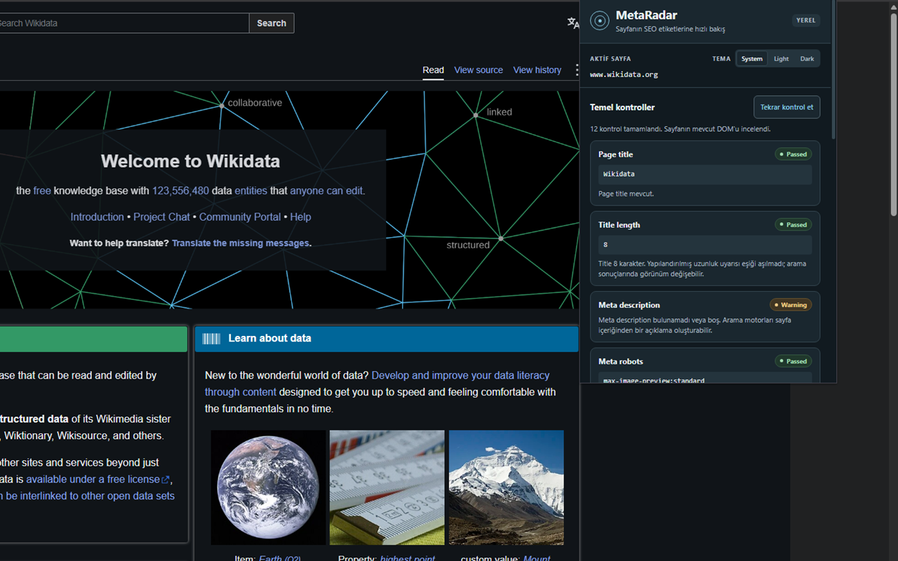

# MetaRadar


A lightweight, privacy-first Chrome extension for inspecting essential on-page SEO metadata.

MetaRadar, aktif sayfanın temel SEO metadata bilgilerini tarayıcı içinde inceler ve sonuçları anlaşılır durum etiketleriyle gösterir. Manifest V3 ile geliştirilmiştir; sayfayı değiştirmez.

## Features

- Page title
- Meta description
- H1
- Canonical
- Robots
- HTML lang
- Missing image alt attributes
- Open Graph
- Hreflang
- Passed / Warning / Error
- System / Light / Dark themes

## Screenshots




## Privacy

- Tüm kontroller yerel olarak işlenir.
- Backend veya external API yoktur.
- Analytics veya tracking yoktur.
- Sayfa verileri ve sonuçlar kalıcı olarak saklanmaz.
- Yalnızca `themePreference`, `chrome.storage.local` içinde saklanır.

## Permissions

- `activeTab`: Eklentiyi açtığınızda aktif sayfaya geçici erişim sağlar.
- `scripting`: Seçili DOM bilgilerini almak için paket içindeki salt okunur sayfa okuyucusunu çalıştırır.
- `storage`: Yalnızca System / Light / Dark tema tercihini yerel olarak saklar.

## How it works

Page DOM → Read / extract → Normalize → Evaluate → Render

Vanilla HTML, CSS ve JavaScript kullanır; framework, runtime dependency veya build adımı yoktur.

## Local installation

1. Repository'yi indirin veya clone edin.
2. Chrome'da `chrome://extensions` adresini açın.
3. **Developer mode** seçeneğini etkinleştirin.
4. **Load unpacked** ile `manifest.json` dosyasını içeren proje kökünü seçin.
5. Bir HTTP/HTTPS sayfasında MetaRadar ikonuna tıklayın.

## Development

Node.js 20+ gerekir. Dependency yoktur; `npm install` gerekmez.

```sh
node --test
node scripts/check-project.js
```

## Privacy Policy

- [English](https://korayaltunbey.github.io/MetaRadar/privacy-policy)
- [Türkçe](https://korayaltunbey.github.io/MetaRadar/privacy-policy-tr)

## Status

Version 1.0.0
